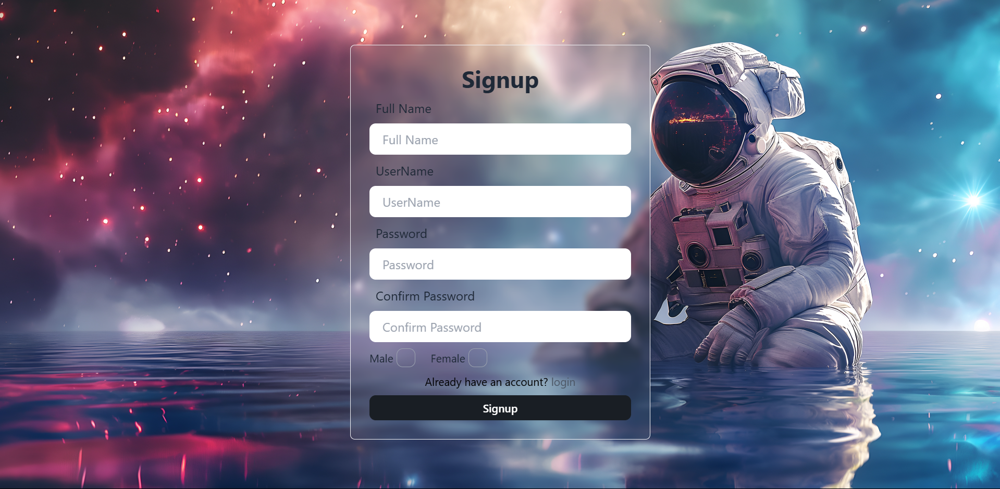
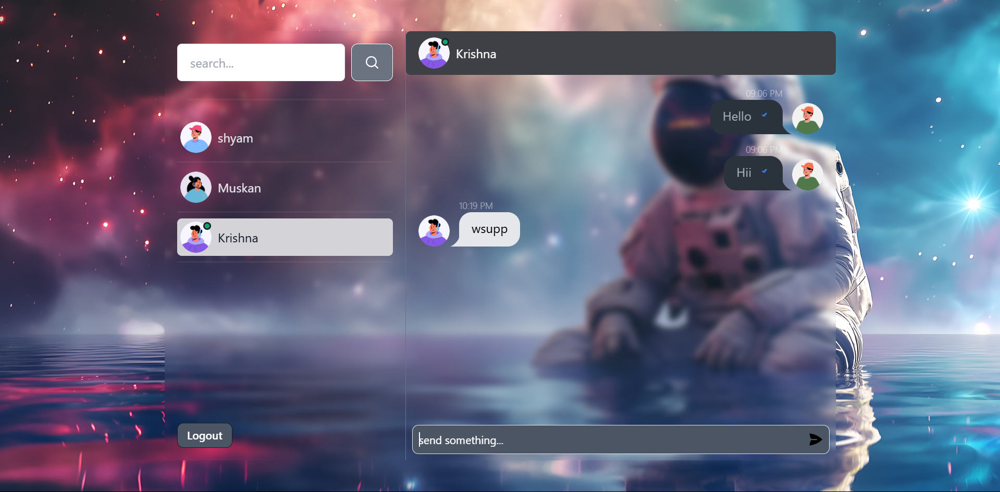

# Sync Project

Sync is a full-stack web application designed to facilitate real-time communication through both backend API services and a responsive frontend interface, this is a web based chatting application.

## Register page

## Login page

## Home page

## Message page

## Tech Stack

### Backend
- **Node.js**: JavaScript runtime built on Chrome's V8 JavaScript engine.
- **Express.js**: Fast, unopinionated, minimalist web framework for Node.js.
- **MongoDB**: NoSQL database for storing conversations, users, and messages.
- **Mongoose**: Elegant MongoDB object modeling for Node.js.
- **Socket.IO**: Library for real-time web applications enabling bi-directional communication.
- **JWT (jsonwebtoken)**: For secure user authentication using JSON Web Tokens.
- **Bcrypt.js**: Library to hash passwords for secure storage.

### Frontend
- **React**: JavaScript library for building user interfaces.
- **Redux**: State management tool for managing application state.
- **Vite**: Frontend build tool for blazing fast performance.
- **Tailwind CSS**: Utility-first CSS framework for building custom designs.
- **ESLint**: Tool for identifying and fixing problems in JavaScript code.
- **Axios**: Promise-based HTTP client for making requests.

## Project Structure

### Backend
- **Environment Variables**: Use the `.env.example` file as a template for setting up the environment variables.
- **Configuration**: 
  - `config/database.js`: Database setup and connection management.
- **Controllers**:
  - `messageController.js`: Handles message-related server-side logic.
  - `userController.js`: Manages user operations, including authentication.
- **Middleware**:
  - `isAuthenticated.js`: Checks user authentication status.
- **Models**:
  - `conversationModel.js`, `messageModel.js`, `userModel.js`: MongoDB models for persistent data storage.
- **Routes**:
  - `messageRoute.js`, `userRoute.js`: API endpoints for messaging and user operations.
- **Socket**:
  - `socket.js`: WebSocket logic for real-time data exchange.

### Frontend
- **Main Components**:
  - `App.jsx`: Root component for initializing the application.
  - **Components**: 
    - `HomePage.jsx`, `Login.jsx`, `Message.jsx`, etc. for UI elements.
- **State Management**:
  - **Redux** integrated with components to manage application state.
- **Utils**:
  - `socketManager.js`: Utility functions for managing socket connections.
- **Hooks**:
  - Custom hooks like `useAuthStatus.js` for handling side-effects and state.

## Installation

### Backend
1. Navigate to the `backend` directory.
2. Run `npm install` to install backend dependencies.
3. Create a `.env` file in the root of the `backend` directory based on the `backend/.env.example` file.
4. Run `node index.js` to start the backend server.

### Frontend
1. Navigate to the `frontend` directory.
2. Run `npm install` to install frontend dependencies.
3. Run `npm run dev` to start the development server.

## Usage

Open your browser and navigate to `http://localhost:<PORT>` to access the application. The application supports user registration, login, and real-time messaging.

## Contributing

Contributions are welcome. Please fork the repository and open a pull request to contribute.

## License

This project is licensed under the MIT License. See the `LICENSE` file for more information.